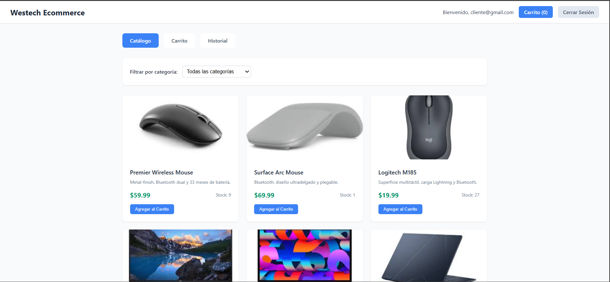
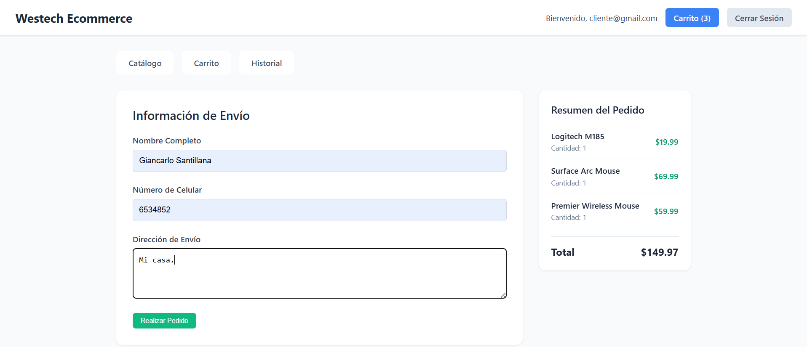
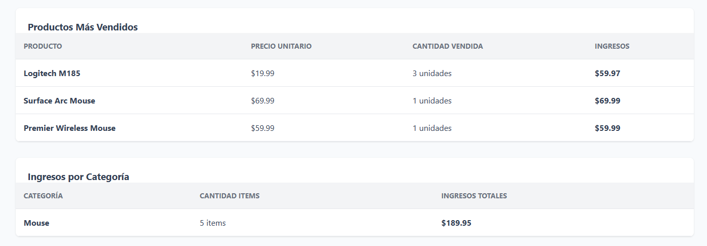
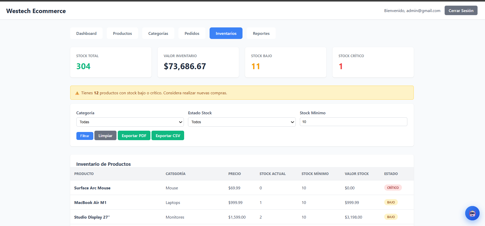
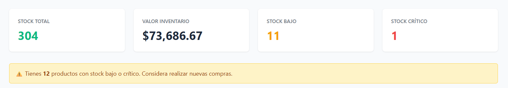
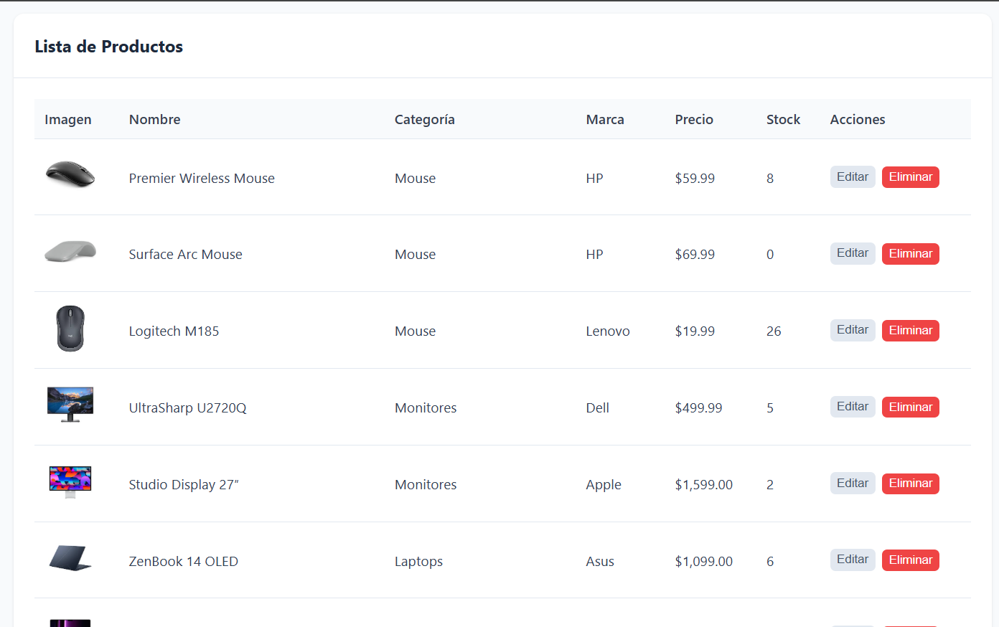
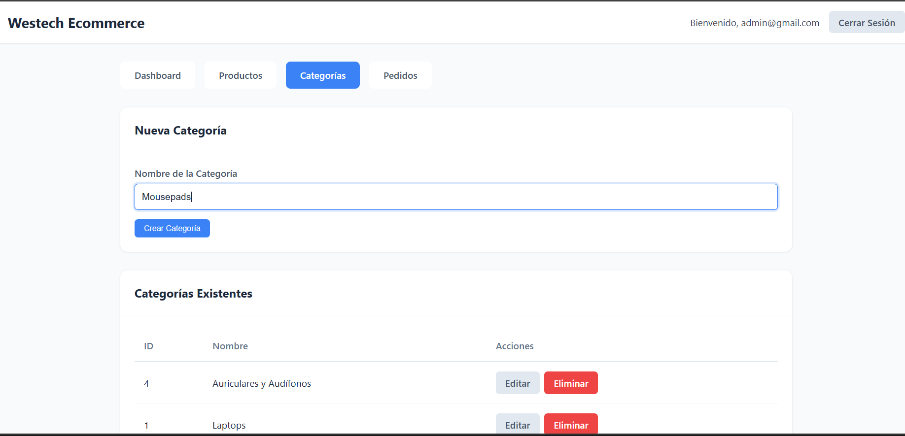
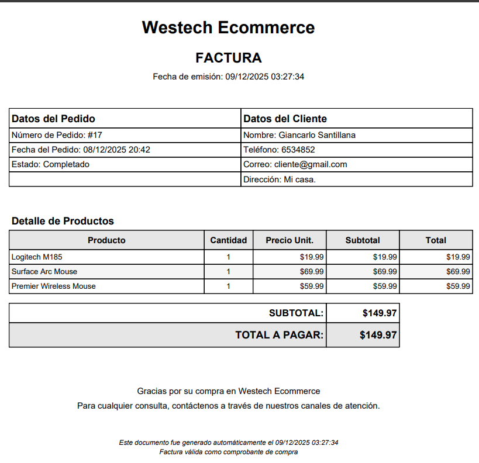
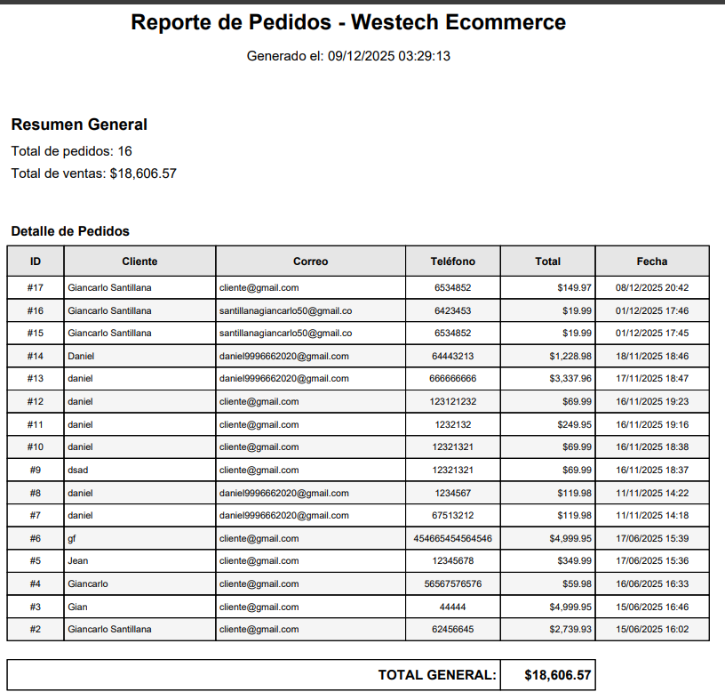

# Documentación del Estado Inicial

## 1. Resumen General del Sistema

### Qué es
El sistema es una plataforma de comercio electrónico (e-commerce) desarrollada en PHP nativo, diseñada para la venta de productos tecnológicos. Permite a los usuarios navegar por un catálogo, gestionar un carrito de compras y realizar pedidos. También cuenta con un panel de administración para gestionar productos y visualizar pedidos.

### Alcance
El sistema cubre el flujo básico de un e-commerce:
*   **Público/Cliente:** Registro, Login, Catálogo de productos, Carrito de compras, Checkout (simulado/registro de pedido), Historial de compras.
*   **Administrador:** Gestión de productos (CRUD), Visualización de pedidos, Dashboard con métricas básicas.

### Usuarios y Roles
El sistema maneja dos roles principales, definidos en la tabla `usuarios` columna `rol`:
1.  **Cliente:** Usuario final que compra productos.
2.  **Admin:** Administrador del sistema con acceso al panel de control (`/admin`).

### Arquitectura General
*   **Tipo:** Monolito en PHP.
*   **Patrón:** No sigue un patrón MVC estricto. Es una arquitectura basada en páginas (Page Controller), donde cada archivo PHP (`index.php`, `productos.php`, etc.) actúa como controlador y vista simultáneamente.
*   **Base de Datos:** Relacional (MySQL/MariaDB).
*   **Frontend:** HTML5, CSS3 y JavaScript nativo (Vanilla JS). Renderizado mayormente en el servidor (SSR).

### Tecnologías Utilizadas
*   **Lenguaje Backend:** PHP 8.x.
*   **Base de Datos:** MySQL / MariaDB.
*   **Librerías Externas (Composer):**
    *   `vlucas/phpdotenv`: Para manejo de variables de entorno (`.env`).
*   **Servicios Externos:**
    *   **Imgur API:** Para el alojamiento de imágenes de productos.
*   **Frontend:** HTML, CSS, JavaScript.

---

## 2. Estructura del Proyecto

### Árbol de Carpetas
```
/
├── admin/                  # Panel de administración
│   ├── index.php           # Dashboard
│   ├── productos.php       # CRUD de productos
│   ├── pedidos.php         # Listado de pedidos
│   ├── categorias.php      # Gestión de categorías
│   └── js/                 # Scripts específicos del admin
├── api/                    # Endpoints API (JSON)
│   ├── categories.php
│   └── products.php
├── cliente/                # Área pública/cliente
│   ├── index.php           # Catálogo principal
│   ├── carrito.php         # Vista del carrito
│   ├── checkout.php        # Proceso de finalización de compra
│   ├── historial.php       # Historial de pedidos del usuario
│   └── js/                 # Scripts del cliente
├── includes/               # Lógica compartida
│   ├── auth.php            # Clase Auth (Login, Register, Roles)
│   ├── db.php              # Conexión a BD (Clase Database)
│   └── functions.php       # Funciones auxiliares (Sanitización, Imgur, etc.)
├── vendor/                 # Dependencias de Composer
├── config.php              # Configuración global y carga de .env
├── index.php               # Router simple / Redirección inicial
├── login.php               # Página de inicio de sesión
├── registro.php            # Página de registro
└── schema.sql              # Esquema de la base de datos
```

### Flujo Interno
1.  **Entrada:** El usuario accede a `index.php`.
2.  **Ruteo:** `index.php` verifica la sesión. Si es admin → `/admin`, si es cliente → `/cliente`, si no → `login.php`.
3.  **Lógica:** Cada archivo PHP (ej. `cliente/carrito.php`) inicia cargando `config.php` y `includes/`.
4.  **Procesamiento:** Se ejecutan consultas a la BD usando la clase `Database` en `includes/db.php`.
5.  **Renderizado:** Se mezcla código PHP con HTML para mostrar la interfaz.

---

## 3. Funcionalidades Existentes

### Cliente
*   **Catálogo:** (`cliente/index.php`) Muestra productos con paginación o listado simple. Permite filtrar por categorías.

*   **Carrito:** (`cliente/carrito.php`) Gestiona productos en sesión (`$_SESSION['cart']`). Permite agregar, actualizar cantidad y eliminar.

*   **Checkout:** (`cliente/checkout.php`) Formulario para datos de envío. Valida stock y crea registros en `pedidos` y `pedido_detalles`.

*   **Historial:** (`cliente/historial.php`) Muestra compras pasadas.

### Admin
*   **Dashboard:** (`admin/index.php`) Métricas rápidas (ventas hoy, total productos) y últimos pedidos.

*   **Gestión de Productos:** (`admin/productos.php`) CRUD completo. Subida de imágenes a Imgur. Validación de entradas.
 
*  **Gestión de Categorías:** (`admin/categorias.php`) CRUD básico para categorías de productos.

*   **Pedidos:** (`admin/pedidos.php`) Listado de todos los pedidos realizados.
 
### API
*   **Endpoints:** `api/products.php` y `api/categories.php` exponen datos en formato JSON, probablemente para consumo asíncrono o integraciones futuras.

### Autenticación (`includes/auth.php`)
*   **Login/Registro:** Uso de `password_hash` (BCRYPT) y `password_verify`.
*   **Sesiones:** Manejo nativo de `$_SESSION`.
*   **Control de Acceso:** Métodos `requireLogin()` y `requireAdmin()` para proteger rutas.

### Manejo de Imágenes (`includes/functions.php`)
*   **Imgur:** Las imágenes no se guardan localmente. Se suben a Imgur usando su API (soporta modo anónimo o OAuth). Se guarda la URL resultante en la BD.

### Seguridad Básica
*   **SQL Injection:** Uso de Prepared Statements (PDO) en casi todas las consultas.
*   **XSS:** Función `sanitizeInput()` que aplica `htmlspecialchars`.
*   **Validación:** Validaciones manuales en el backend (ej. regex para precios, teléfonos).

---

## 4. Base de Datos

### Tablas y Relaciones
1.  **`usuarios`**: Almacena credenciales y roles.
    *   *Columnas:* `id`, `correo`, `contrasena`, `rol`, `creado_en`.
2.  **`categorias`**: Categorías de productos (Laptops, Smartphones, etc.).
    *   *Columnas:* `id`, `nombre`.
3.  **`marcas`**: Marcas de fabricantes (Apple, Samsung, etc.).
    *   *Columnas:* `id`, `nombre`.
4.  **`productos`**: Inventario principal.
    *   *Relaciones:* `id_categoria` -> `categorias(id)`, `id_marca` -> `marcas(id)`.
    *   *Columnas:* `id`, `nombre`, `descripcion`, `precio`, `stock`, `imagen_url`, `imagen_deletehash`.
5.  **`pedidos`**: Cabecera de los pedidos.
    *   *Relaciones:* `id_usuario` -> `usuarios(id)`.
    *   *Columnas:* `id`, `nombre_cliente`, `direccion`, `total`, `creado_en`.
6.  **`pedido_detalles`**: Renglones de cada pedido.
    *   *Relaciones:* `id_pedido` -> `pedidos(id)`, `id_producto` -> `productos(id)`.
7.  **`historial_compras`**: Tabla redundante o de auditoría para compras rápidas.
    *   *Relaciones:* `id_usuario`, `id_producto`.
---

## 5. Arquitectura UML (Estado Inicial)
LOREMLOREMLOREMLOREMLOREMLOREMLOREMLOREMLOREMLOREMLOREMLOREMLOREMLOREMLOREMLOREMLOREMLOREMLOREMLOREMLOREMLOREMLOREM

---

## 6. Requerimientos Iniciales

### Requerimientos Funcionales (RF)
*   **RF01:** El sistema debe permitir el registro e inicio de sesión de usuarios.
*   **RF02:** El administrador debe poder crear, leer, actualizar y eliminar productos.
*   **RF03:** El cliente debe poder ver el catálogo de productos.
*   **RF04:** El cliente debe poder agregar productos al carrito.
*   **RF05:** El sistema debe procesar pedidos y descontar stock.

### Requerimientos No Funcionales (RNF)
*   **RNF01 (Disponibilidad):** El sistema debe estar disponible 99.0% del tiempo.
*   **RNF02 (Usabilidad):** La interfaz debe ser responsiva (móvil y escritorio).
*   **RNF03 (Rendimiento):** Las páginas deben cargar en menos de 2 segundos bajo carga normal.

---

## 7. Problemas, Riesgos y Limitaciones

### Problemas Técnicos
*   **Código Espagueti:** Mezcla de lógica de negocio, acceso a datos y presentación HTML en los mismos archivos. Dificulta el mantenimiento.
*   **Duplicación de Código:** Validaciones y consultas similares repetidas en varios archivos.
*   **Manejo de Errores:** Básico. Si falla la BD, el usuario ve un mensaje genérico o un error de PHP si `display_errors` está activo.

### Riesgos de Seguridad
*   **Exposición de Errores:** `ini_set('display_errors', 1)` está activado en producción (`cliente/index.php`), lo que puede revelar rutas y detalles de la BD.
*   **CSRF:** No se observa protección contra Cross-Site Request Forgery en los formularios.
*   **Sesiones:** No parece haber regeneración de ID de sesión en acciones críticas (aunque sí en login).

### Code Smells
*   **God Files:** Archivos como `productos.php` hacen demasiadas cosas (validar, guardar, listar, renderizar).
*   **Hardcoding:** Credenciales o configuraciones por defecto en `config.php` si falla el `.env`.

### Ausencias Importantes
*   No hay sistema de recuperación de contraseñas.
*   No hay pasarela de pagos (solo registro de pedido).
*   No hay tests.